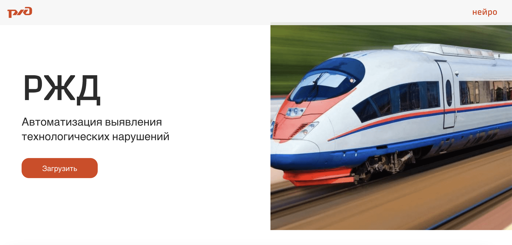
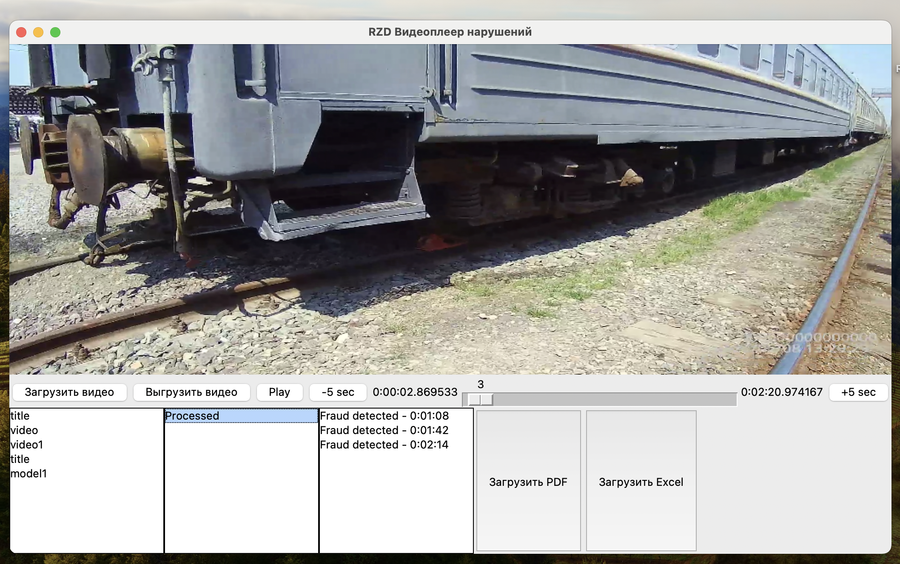

# Автоматизация выявления технологических нарушений

## Задача
Участникам предлагается создать программный модуль, который с помощью ИИ проанализирует видеозаписи с нагрудных 
регистраторов для определения правильности использования СИЗ, наличия спецодежды и выявления технологических нарушений.
Программное обеспечение должно идентифицировать нарушения, предоставляя возможность проверки конкретных отрезков видео 
с выявленными нарушениями.

[Dataset](https://lodmedia.hb.bizmrg.com/case_files/1101244/train_dataset_rzhd_fix_train.zip)

## Список использованных технологий:
- Python
- PyTorchVideos 
- YOLOv8
- Docker
- Django
- Tkinter
- React
- PostgreSQL
- Nginx
- Celery

## Запуск проекта
```sh
   docker compose up --build
```

# Результаты

## Interface

### web

### desktop (отдельный readme.md для запуска)


## Контакты
DS:
- https://github.com/jettooss
- https://github.com/BogdanRoshchupkin
FRONT:
- https://github.com/MarianRoshchupkin
BACKEND:
- https://github.com/deZKI
